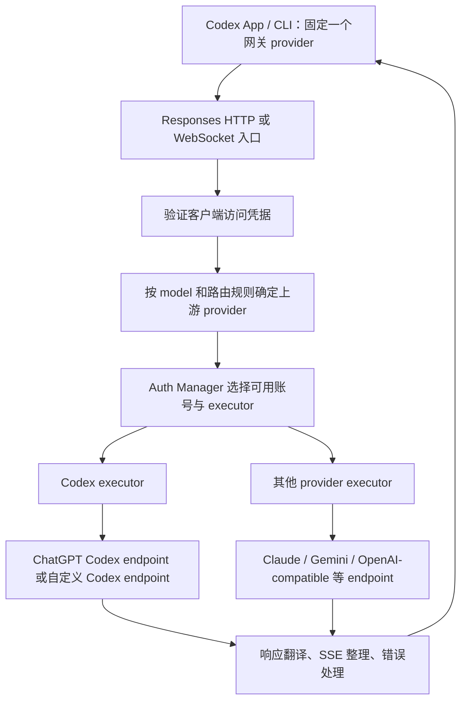

# CLIProxyAPI 的 Codex 代理机制分析

分析日期：2026-09-12。扫描对象：本工作区的 `reference/CLIProxyAPI`，Git HEAD 为 `09a29bd345bc44c473abe7fd07859e32df2ea543`，扫描时该引用仓库工作树无修改。

本文基于本地源码和测试代码的静态分析；未启动代理、执行 OAuth 登录、调用真实模型或运行 Go 测试。测试文件是行为设计的证据，不代表本次已验证测试通过。本文描述该源码快照，不将其第三方实现等同于官方支持承诺。

## 1. 结论

CLIProxyAPI 是独立的应用层 API 网关。客户端主动把模型请求发到它提供的 endpoint；网关根据请求中的 `model` 选择上游 provider、账号和 executor，转换请求协议、发起上游请求，再把响应转换回客户端需要的格式。

它没有修改 Codex App 的 JavaScript，也不拦截本地 App Server 的 `thread/start` RPC。它接收的是更下一层的模型推理请求，如 HTTP `POST /v1/responses` 或 WebSocket `response.create`。

因此，Codex 客户端可以始终配置一个 provider、一个网关地址，而网关内部在每次请求时选择不同 endpoint。客户端的 provider ID 与网关内部的 provider ID 是两个独立概念。

本项目还实现了 ChatGPT/Codex OAuth 上游：自行完成 OAuth、保存和刷新凭据，然后请求 `https://chatgpt.com/backend-api/codex/responses`。它不是简单地把 OpenAI API Key 请求转发到 `api.openai.com`。

## 2. 两个方向都叫“支持 Codex”，需要分开理解

| 方向 | 含义 | 主要实现 |
|---|---|---|
| Codex 作为下游客户端 | 接收 Codex 发出的 Responses 请求，可路由到 Codex、Claude、其他兼容上游 | API handlers、模型路由、协议转换器 |
| Codex 作为上游服务 | 使用 Codex OAuth 或配置的 API Key，调用 Codex Responses endpoint | CodexAuthenticator、CodexExecutor、CodexWebsocketsExecutor |

这两个方向可以组合。例如：Codex App → CLIProxyAPI → ChatGPT Codex；也可以是其他兼容客户端 → CLIProxyAPI → ChatGPT Codex，或 Codex App → CLIProxyAPI → 其他模型服务。



## 3. 请求入口：通过配置接入，不修改桌面 App

[server_routes.go](reference/CLIProxyAPI/internal/api/server_routes.go) 的 `setupRoutes` 注册：

| 路径 | 方法 | 作用 |
|---|---|---|
| `/v1/responses` | POST | Responses 请求，按 `stream` 区分流式与非流式 |
| `/v1/responses` | GET / WebSocket Upgrade | Responses WebSocket 会话 |
| `/v1/responses/compact` | POST | 上下文压缩专用请求 |
| `/v1/models` | GET | 模型目录 |
| `/backend-api/codex/responses` | POST / GET | Codex 直连路径别名，复用 Responses handlers |
| `/backend-api/codex/responses/compact` | POST | compact 路径别名 |

`/v1` 和 `/backend-api/codex` 都挂载访问认证中间件。代码将后一组标为 `chatgpt_base_url compatible`；路径兼容不等于自动复用桌面 App 的登录，也不意味着跳过网关自己的认证。

在常规自定义 provider 接入下，客户端固定指向网关 `/v1`。更改请求中的 `model` 即可触发新的路由决策，客户端无需修改自己的 provider 配置。

## 4. 路由：model → provider → auth → executor → endpoint

### 4.1 Handler 从请求体读取模型

[openai_responses_handlers.go](reference/CLIProxyAPI/sdk/api/handlers/openai/openai_responses_handlers.go) 中：

- `Responses` 读取请求并区分流式与非流式。
- `handleNonStreamingResponse` 读取 `model`，调用 `ExecuteWithAuthManager`。
- `handleStreamingResponse` 读取 `model`，调用 `ExecuteStreamWithAuthManager`。

入口协议是 Responses，但目标 executor 可以属于其他 provider。协议类型本身不把所有请求固定到 OpenAI。

### 4.2 查路由规则和模型注册表

[handlers_execution.go](reference/CLIProxyAPI/sdk/api/handlers/handlers_execution.go) 先运行 `applyModelRouter`，然后通过 [handlers_routing.go](reference/CLIProxyAPI/sdk/api/handlers/handlers_routing.go) 的 `providersForExecution` 确定候选 provider。

主要分支：显式路由指定 provider/目标模型时使用该结果；普通路径查询模型注册表；Home 模式另有分发路径。插件 executor 也是单独分支。

普通路径调用 [provider.go](reference/CLIProxyAPI/internal/util/provider.go) 的 `GetProviderName`，最终查询 `GetGlobalRegistry().GetModelProviders(modelName)`。该函数的旧注释提到按名称猜测，但当前函数体没有这种兜底，不能据注释认定任意 `gpt-*` 都会自动路由。

无法解析上游的模型返回 HTTP 400、`model_not_found`，不会凭空选一个地址。

### 4.3 选择账号和执行器

[conductor_execution.go](reference/CLIProxyAPI/sdk/cliproxy/auth/conductor_execution.go) 的 `Manager.Execute` / `ExecuteStream` 管理执行和重试，执行过程中通过 `pickNextMixed` 选出 auth、executor、provider，并处理上游模型别名等信息。

[service_executors.go](reference/CLIProxyAPI/sdk/cliproxy/service_executors.go) 将账号对应的模型注册到 registry，并为 `codex` 注册 `NewCodexAutoExecutor`。

请求中的模型不一定直接等于上游模型 ID；配置可提供别名和前缀。同名模型也可能由多个账号提供。要稳定指定不同 endpoint，建议使用无歧义的客户端模型别名，而不是让名称碰撞后依赖轮询选择。

## 5. 认证：客户端访问网关与网关访问 Codex 分离

### 5.1 下游认证

[server_middleware.go](reference/CLIProxyAPI/internal/api/server_middleware.go) 的 `AuthMiddleware` 使用 access manager 验证请求。客户端携带的网关访问凭据用于进入代理。

### 5.2 Codex OAuth 登录

[sdk/auth/codex.go](reference/CLIProxyAPI/sdk/auth/codex.go) 实现授权码登录：

1. 生成 PKCE verifier/challenge 和随机 state。
2. 启动本地 OAuth callback server，默认端口 1455。
3. 打开浏览器授权地址，等待回调或手工输入回调信息。
4. 验证 state，使用 code 和 PKCE verifier 换取 token。
5. 构建 `Provider: codex` 的认证记录。

[openai_auth.go](reference/CLIProxyAPI/internal/auth/codex/openai_auth.go) 中的认证服务地址是 `https://auth.openai.com/oauth/authorize` 与 `https://auth.openai.com/oauth/token`，默认回调为 `http://localhost:1455/auth/callback`，授权 scope 包含 `offline_access`。

[codex_device.go](reference/CLIProxyAPI/sdk/auth/codex_device.go) 还支持设备码流程。命令行入口 [main.go](reference/CLIProxyAPI/cmd/server/main.go) 暴露 `--codex-login` 和 `--codex-device-login`。

[token.go](reference/CLIProxyAPI/internal/auth/codex/token.go) 定义的持久化内容包括 access token、refresh token、ID token、account ID、到期时间等。

这里确认的是代理自身的登录流程。不能据此推断“桌面 App 已登录，所以代理自动可用”，也不能把某个本地现存登录文件的导入能力当作已验证事实。本次未读取任何真实 token。

### 5.3 上游凭据选择与刷新

[codex_executor_auth.go](reference/CLIProxyAPI/internal/runtime/executor/codex_executor_auth.go) 的 `codexCreds`：

```text
token   = auth.Attributes["api_key"]
          否则 auth.Metadata["access_token"]
baseURL = auth.Attributes["base_url"]
```

`Refresh` 使用 refresh token 更新 token 和账号元信息；代码调用带重试的刷新方法，前置还允许 Home 分支处理刷新。

因此代理支持 OAuth 账号，也支持 `codex-api-key` 配置的自定义 Codex endpoint。配置示例见 [config.example.yaml](reference/CLIProxyAPI/config.example.yaml)。

## 6. Codex 上游 HTTP 请求如何形成

[codex_executor_execute.go](reference/CLIProxyAPI/internal/runtime/executor/codex_executor_execute.go) 的普通执行链为：

```text
解析上游模型 → 取凭据和 baseURL → 将源协议转换为 Codex 格式
→ 应用 reasoning / payload 配置 → 标准化工具和输入
→ POST {baseURL}/responses → 解析结果 → 转回下游协议
```

baseURL 未配置时默认为 `https://chatgpt.com/backend-api/codex`，最终路径为 `/responses`。

[codex_executor_request.go](reference/CLIProxyAPI/internal/runtime/executor/codex_executor_request.go) 的 `applyCodexHeadersFromSources` 设置：

- `Authorization: Bearer <选中的上游 token>`，并非盲目透传下游 Authorization。
- `Content-Type: application/json`，流式时 `Accept: text/event-stream`。
- OAuth 场景的 `Chatgpt-Account-Id`。
- Codex User-Agent、Originator 及会话/请求元数据；支持配置和自定义 header 处理。

代码还有可配置的 Codex header 标准化，以及有条件的身份标识重写。这些是兼容选项，不是模型路由成立的必要条件。HTTP 客户端通过 `NewUtlsHTTPClient` 构建。

### 6.1 请求转换不是原样转发

[codex_openai-responses_request.go](reference/CLIProxyAPI/internal/translator/codex/openai/responses/codex_openai-responses_request.go) 的 `ConvertOpenAIResponsesRequestToCodex` 包含：

| 输入内容 | Codex 转换行为 |
|---|---|
| 字符串 `input` | 转为 user message/input_text 数组 |
| `stream` / `store` | 设置为 `true` / `false` |
| `include` | 设置为包含 `reasoning.encrypted_content` 的数组 |
| `max_output_tokens`、`max_completion_tokens`、`temperature`、`top_p` | 删除 |
| `system` role | 转为 `developer` |
| 部分 cache、user、truncation 字段 | 删除或兼容处理 |
| 工具和 compaction 信息 | 进行专门标准化 |

HTTP executor 进一步删除 `previous_response_id` 等字段、补齐 `instructions`、规范工具 schema 和 input item ID，并按条件处理 parallel tool calls、图像工具等。最终参数以完整处理流水线为准，不应只复制某一行转换逻辑。

特别是：删除 `previous_response_id` 不会自动恢复历史。如果原请求只有增量 input，必须由客户端或网关会话层补齐可重放上下文。

### 6.2 非流式请求也可能以流式方式访问上游

`CodexExecutor.Execute` 将上游请求设为 `stream: true`，读完上游 SSE，收集 `response.output_item.done`，在 `response.completed` / `response.incomplete` 终态整理结果，再经 `TranslateNonStream` 返回下游普通 JSON。

这解释了它为何不能用简单的 `fetch(...).json()` 实现所有路径。

## 7. SSE：转换事件、修复输出、明确失败边界

[codex_executor_stream.go](reference/CLIProxyAPI/internal/runtime/executor/codex_executor_stream.go) 的 `ExecuteStream` 读取上游 SSE，处理终态错误、usage、output items，并通过翻译器输出客户端协议事件。

下游 [openai_responses_handlers.go](reference/CLIProxyAPI/sdk/api/handlers/openai/openai_responses_handlers.go) 还有 `responsesSSEFramer`，负责帧边界和终态 payload 修复等工作。响应返回兼容性不只是设置 `Content-Type: text/event-stream`。

源码支持启动阶段缓冲：启用时，可以在尚未向下游暴露握手事件前识别“HTTP 200 内携带的容量/过载失败”，让上层尝试重试。相关测试也覆盖默认关闭时的直接转发行为，不能把缓冲描述为无条件启用。

一旦已有输出交给客户端，重试需要避免把两次生成混为一条流。[handlers_stream_bootstrap_test.go](reference/CLIProxyAPI/sdk/api/handlers/handlers_stream_bootstrap_test.go) 明确包含 `DoesNotRetryAfterFirstByte` 测试。

额度错误还有账号级和模型级冷却区分，见 [codex_quota_failover_test.go](reference/CLIProxyAPI/test/codex_quota_failover_test.go)。冷却、重试和选择其他账号是条件行为，并非所有错误都可以切换账号恢复。

## 8. WebSocket 与同一会话切换模型

### 8.1 下游 WebSocket 不等于上游一定使用 WebSocket

[codex_websockets_executor.go](reference/CLIProxyAPI/internal/runtime/executor/codex_websockets_executor.go) 的 `CodexAutoExecutor` 仅在以下两项同时成立时选择 Codex WebSocket executor：

1. 下游请求来自 WebSocket。
2. 被选中的 auth 启用了 `websockets`。

其他普通请求使用 HTTP executor。但若请求明确依赖当前上游 WebSocket 状态，就返回要求 replay 的错误，不能随意降级。compact 等路径有专门处理。

具体握手失败分支见 [codex_websockets_execute.go](reference/CLIProxyAPI/internal/runtime/executor/codex_websockets_execute.go)：HTTP 426 的直接 HTTP fallback 也有条件，不能说“任何 WebSocket 错误都会自动退回 HTTP”。

### 8.2 同一连接可以重新按模型选择 provider

[openai_responses_websocket.go](reference/CLIProxyAPI/sdk/api/handlers/openai/openai_responses_websocket.go) 为各次消息解析请求模型，维护 `pinnedAuthID`、`pinnedAuthByProvider` 和上游连接模式。

收到新模型时检查旧 auth 是否支持它；不匹配则解除当前绑定，并尝试恢复对应 provider 先前合适的绑定或重新选择。模型匹配逻辑见 [openai_responses_websocket_session.go](reference/CLIProxyAPI/sdk/api/handlers/openai/openai_responses_websocket_session.go)。

最直接的证据是 [openai_responses_websocket_test.go](reference/CLIProxyAPI/sdk/api/handlers/openai/openai_responses_websocket_test.go) 第 4088 行的 `TestResponsesWebsocketSwitchesPinnedAuthAcrossProviders`。测试在一条下游连接依次发送：

```text
response.create(model = xAI 模型)
response.create(model = Codex 模型)
response.create(model = xAI 原模型或另一模型)
response.create(未指定 model，沿用会话模型)
```

测试断言请求被送到相应 executor/auth。这里使用的是测试替身，证明实现意图和调用链，不是对真实桌面客户端的端到端实测。

### 8.3 完整历史与增量状态是切换的关键

原生 WebSocket 可以依赖 `previous_response_id + 增量 input` 继续生成。这种 ID 和状态属于旧上游，切到另一个账号、provider 或连接后通常无法继续引用。

该 handler 区分两类情况：

- **完整、自包含的 `response.create`**：允许作为 reset 建立新的上游路径。
- **仍依赖旧上游的增量请求**：当无法沿用当前上游连接时，关闭连接并发出 replay-required 信号，要求客户端按恢复流程重发完整历史。

对应测试包括 `TestResponsesWebsocketFullRequestCanRouteFromNativeWebsocketToBuiltInProvider` 和 `TestResponsesWebsocketDeltaRouteToBuiltInProviderRequiresFullReplay`，均在上述测试文件。

所以，“同一 Codex 会话切换不同 endpoint”有服务端实现基础，但不能仅凭模型路由保证所有切换无缝完成。还要验证具体 Codex 版本是否重发历史、正确响应 replay 信号，以及历史工具项是否兼容目标模型。

## 9. reasoning、工具与缓存的边界

工具调用需要保留函数名、参数、call ID、工具结果间的对应关系；普通对话文本转换正确，不代表 agent 工具循环可用。该仓库为工具 schema、input item ID、parallel calls、孤立工具结果、compaction 等提供了大量专门逻辑。

[codex_executor_reasoning.go](reference/CLIProxyAPI/internal/runtime/executor/codex_executor_reasoning.go) 的 reasoning replay cache 按模型和会话划分；当前 `codexReasoningReplayEnabledForSource` 只对 Claude 源协议启用。不能把它解释为“为所有 Codex App 请求提供通用历史存储”。

`prompt_cache_key` 和 `Session-Id` 用于会话关联/缓存；它们不是可跨所有上游使用的对话数据库。加密 reasoning 和 provider 专有状态也不能假定在另一模型服务中可用。

## 10. 模型列表兼容

[openai_handlers.go](reference/CLIProxyAPI/sdk/api/handlers/openai/openai_handlers.go) 的 `OpenAIModels` 检查 `client_version` 查询参数：存在时构建 Codex 客户端模型格式，否则走普通模型响应。

[codex_client_models.go](reference/CLIProxyAPI/sdk/api/handlers/openai/codex_client_models.go) 调用 `BuildResponseForClient`，结合可用模型、provider 注册信息与客户端版本生成目录。

这是服务端为 Codex 客户端准备模型元数据的能力。但实际 App 是否请求该 endpoint、使用远程结果还是本地 catalog，仍需按具体客户端验证。单独返回普通 `/v1/models` 的 `id` 列表不足以保证桌面模型菜单出现所有模型。

## 11. 对当前 copilot-api 的借鉴

当前工作区 [src/routes/responses/handler.ts](src/routes/responses/handler.ts) 已调用 `resolveModelRoute`，按 provider 分支调用 Copilot 或 DeepSeek 的 Responses 服务。因此，按模型选择上游的基础已经存在。

若后续增加 Codex OAuth 上游，建议拆成以下模块，而不是把登录和所有兼容修复写进现有 handler：

| 模块 | 最小职责 |
|---|---|
| Codex 认证管理 | OAuth 获取、持久化、到期刷新、刷新并发控制 |
| 模型路由 | 明确模型别名、上游模型 ID、provider 和 endpoint |
| Codex executor | 选中账号的 token、account header、Responses endpoint |
| 请求兼容层 | instructions、工具、参数、reasoning 和输入项标准化 |
| SSE 处理 | 事件边界、终态、工具输出、断流和首字节前重试 |
| 会话状态层 | 完整历史与增量历史分开处理；跨上游时 reset/replay |
| 模型目录 | 向 Codex 暴露真实能力和可用模型 |

建议先验证 HTTP/SSE、完整历史请求下的模型切换，再增加 WebSocket 增量优化。这样可以先验证路由和协议正确性，再处理连接状态和重放。

后续实施的关键验收场景是：同一任务内 A → B → A；切换后读取前文；工具调用及结果配对；reasoning 项兼容；OAuth 刷新；流中断；额度错误；WebSocket 增量切换要求 replay。本文没有实施这些改动。

## 12. 关键源码索引

以下行号对应扫描快照，后续更新可能变化。

| 证据 | 文件与定位 |
|---|---|
| HTTP、WS、直连别名入口 | `internal/api/server_routes.go:62, 111` |
| 从 model 执行请求 | `sdk/api/handlers/openai/openai_responses_handlers.go:621, 647` |
| 调用 Auth Manager | `sdk/api/handlers/handlers_execution.go:44` |
| provider 路由 | `sdk/api/handlers/handlers_routing.go:128` |
| 注册表查询实际实现 | `internal/util/provider.go:43` |
| 账号与 executor 选择 | `sdk/cliproxy/auth/conductor_execution.go:121, 232, 489` |
| 注册 Codex executor | `sdk/cliproxy/service_executors.go:258` |
| OAuth 授权码登录 | `sdk/auth/codex.go:38` |
| OAuth 服务地址 | `internal/auth/codex/openai_auth.go:25` |
| 上游 endpoint 和转换 | `internal/runtime/executor/codex_executor_execute.go:22` |
| 上游 token/baseURL 选择 | `internal/runtime/executor/codex_executor_auth.go`，`codexCreds` |
| 请求 header | `internal/runtime/executor/codex_executor_request.go`，`applyCodexHeadersFromSources` |
| Responses → Codex 格式 | `internal/translator/codex/openai/responses/codex_openai-responses_request.go:14` |
| HTTP/WS executor 选择 | `internal/runtime/executor/codex_websockets_executor.go:67, 80` |
| 跨 provider 与 replay 判定 | `sdk/api/handlers/openai/openai_responses_websocket.go:429` |
| 同连接跨 provider 测试 | `sdk/api/handlers/openai/openai_responses_websocket_test.go:4088` |
| 完整请求切换/增量需 replay 测试 | 同上，`:3492, 3638` |
| Codex 模型格式入口 | `sdk/api/handlers/openai/openai_handlers.go:61` |

最终判断：CLIProxyAPI 提供了“客户端固定一个 provider，代理内部逐请求路由到不同 endpoint”的完整架构，并针对 Codex OAuth、协议差异及 WebSocket 会话状态做了专门适配。真正复杂的部分是认证生命周期、历史重放、工具与 reasoning 兼容，而不是单独的一张 model → URL 映射表。
