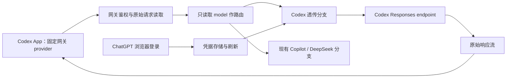

# Codex 透传与登录：实现及测试计划

日期：2026-09-12。状态：待实施。

本计划针对当前 `copilot-api` 工作区，依据现有 TypeScript 源码及本地 `reference/CLIProxyAPI` 快照。此次仅编写计划，没有修改运行代码、执行登录或调用真实模型。官方 OpenAI 文档本次因网络限制未能读取；OAuth 参数、Codex endpoint 和客户端能力必须在实施阶段核验，第三方参考实现不代表官方支持承诺。

## 1. 目标与验收范围

在 Codex App 中固定使用一个指向 `copilot-api` 的 provider，在同一任务中通过切换模型，由代理选择 Codex、Copilot 或 DeepSeek 上游。新增 Codex 上游支持浏览器 ChatGPT 登录、凭据持久化及刷新，并且仅处理路由、鉴权和必要的 HTTP 传输头。

新增 Codex 路径的核心约束：**请求体和响应体保持原始字节内容，不进行 Responses 协议转换，不修改模型名、工具、reasoning 或历史。** HTTP 分块边界、头字段大小写和 TCP 数据包不属于字节一致性承诺。

当前 Copilot、DeepSeek 分支继续使用其现有实现；本计划不把它们声明为严格透传，也不将所有上游统一重构。只有原生接受该客户端请求格式的 endpoint 才能加入严格透传路径。原生 Chat Completions/Anthropic 接口无法仅靠鉴权注入变成 Responses 接口。

最小交付包括：

1. 浏览器 OAuth 登录、登录状态查看、退出本地登录及自动刷新。
2. Codex 模型的精确路由及 HTTP/SSE 透传。
3. 模型目录与 Codex App 接入说明。
4. 断流、取消、错误、凭据隔离和原始字节保真测试。
5. 同一 App 任务 A → B → A 的实际验收记录，明确历史与工具兼容范围。

不包含协议转换器、请求字段修复、历史补齐、账号轮询、自动故障转移或 App 补丁。WebSocket 由客户端探测结果决定是否成为必需实施阶段；设备码登录作为后续增强。

## 2. 当前实现与接入位置

| 当前文件 | 已有行为 | 计划改动 |
|---|---|---|
| [runtime-config.ts](src/lib/runtime-config.ts) | 严格配置 schema；Copilot/DeepSeek 默认值、环境覆盖和启用检查 | 新增可选 Codex 配置；旧配置无需迁移；更新至少一个 provider 启用的校验 |
| [model-routing.ts](src/lib/model-routing.ts) | DeepSeek 精确匹配，其余回退 Copilot，可能解析别名 | 增加 Codex 精确匹配、模型归属冲突检查；Codex 不解析别名 |
| [handler.ts](src/routes/responses/handler.ts) | 读取原始 body；模型别名改写；Copilot reasoning 清理和 SSE ID 标准化；部分请求记录内容 | 在任何改写、正文日志、响应 clone 之前分流 Codex；复用一次读取的原始 body |
| [route.ts](src/routes/responses/route.ts) | 仅 POST `/`，异常经 `forwardError` 处理 | 接入透传 handler；按实测增加 compact；区分本地异常与上游响应 |
| [server.ts](src/server.ts) | `/responses`、`/v1/responses` 别名；全局 CORS；当前未见统一访问密钥认证 | 新 Codex 请求加入网关鉴权；检查 CORS 对响应头的影响 |
| [start.ts](src/start.ts) | 启动前刷新 catalog，再加载配置；Copilot 关闭时可跳过 GitHub 登录 | 配置先于 provider 目录生成；支持仅 Codex 启动；不自动弹出登录 |
| [auth.ts](src/auth.ts)、[main.ts](src/main.ts) | 当前 `auth` 是 GitHub 登录 | 新增独立 `codex-auth` 命令，保留旧命令语义 |
| [paths.ts](src/lib/paths.ts) | 用户数据目录及 GitHub token 文件初始化耦合 | Codex 独立存储，不创建或修改 GitHub token |
| [codex-models.ts](src/lib/codex-models.ts)、[models/route.ts](src/routes/models/route.ts) | 本地 Codex catalog 与普通模型 API 是两条路径 | 为 Codex 路由接入两种目录；不假定 App 自动读取 `/v1/models` |

当前 `package.json` 的 build 使用 `tsdown`，与 AGENTS.md 中工具名称描述不同；验收仍使用约定命令 `bun run build`，另有 `bun run typecheck` 可用。已有工作区修改不属于本计划实施内容，后续应只修改涉及本功能的片段。

## 3. 请求架构与透传契约



### 3.1 请求体

- 读取 `ArrayBuffer`，仅对副本进行严格 UTF-8 解码及 JSON 解析，提取非空字符串 `model`。根值必须为对象。
- 将原始 `ArrayBuffer` 直接传给上游；Codex 分支不得调用 `JSON.stringify` 重建 body。
- 不改 `stream`、`store`、`instructions`、`include`、`previous_response_id`、`conversation`、`input`、`tools` 或模型名；未知字段也保留。
- 不剥离 encrypted reasoning，不标准化 item/call ID，不给缺失字段补默认值。上游拒绝的参数通过原始错误响应反馈。
- 设置有限请求体大小，超限返回 413；无效 JSON/UTF-8/模型返回 400。校验不遍历或重写业务字段。
- 不接受请求体或查询参数提供的任意上游 URL；地址只来自受信配置。

严格透传下，客户端 `model` 必须是上游实际接受的 ID。同一 ID 不能同时用来选择两个 endpoint；配置冲突在启动时失败。若未来必须支持 `codex/model-x` → `model-x` 这样的别名，需要明确新增“允许改写模型名”的模式，不计入本计划严格透传验收。

### 3.2 路由与端点

- 在通用 Copilot fallback 和别名处理前查询 Codex 配置模型；命中但禁用时返回明确错误，不能偷偷回退。
- 启动时验证 Codex 模型与 DeepSeek 显式模型及已知 Copilot 模型/别名不冲突；若 Copilot 目录尚未获取，记录并在目录加载后完成校验再接收请求。
- 非 Codex 未命中模型保留现有路由行为。本次不以“严格路由”为理由改变旧客户端的 fallback。
- 默认上游 base URL 依据参考源码为 `https://chatgpt.com/backend-api/codex`，POST `/responses`。
- `/responses` 与 `/v1/responses` 共用同一分流逻辑；不将下游路径直接拼接成任意上游路径。
- `POST /responses/compact` 与 `/v1/responses/compact`：P0 探测客户端使用情况；若使用则纳入交付，按 `model` 路由，原始 body 发往 `/responses/compact`。缺少路由信息明确失败，不猜测“最近一次模型”。
- `/backend-api/codex/*` 别名不是固定自定义 provider 方案的必需项，当前不增加。

### 3.3 HTTP 头与鉴权边界

下游网关访问凭据和上游 OAuth token 是两套独立凭据。Codex App 使用网关密钥访问本地 provider；代理通过自身登录取得 ChatGPT token。App 已登录不等于代理自动登录，本实现也不读取或改写 App 的登录文件。

| 类别 | 规则 |
|---|---|
| 上游 Authorization | 替换为所选凭据的 `Bearer access_token`；禁止转发下游网关 token |
| `Chatgpt-Account-Id` | 从同一份凭据快照注入；覆盖客户端同名字段，防止 token/account 错配 |
| 客户端 API Key/Cookie/代理凭据 | 去除已知认证头，例如 `x-api-key`、`Cookie`、`Proxy-Authorization`；不作为上游身份来源 |
| 普通端到端头 | 保留合理的请求语义和 Codex 会话元数据；具体允许项在 P0 根据脱敏请求确认 |
| hop-by-hop 头 | 去除 `Connection` 及其列出的头、`Keep-Alive`、`Transfer-Encoding`、`Upgrade` 等；WS 另行处理 |
| Host / Content-Length | 交给客户端传输层按目标和实际 body 管理 |
| User-Agent / Originator / Beta | 优先保留实测所需客户端值；仅对已确认必需但缺失的值补充，列出固定规则，不照搬 CLIProxyAPI 全部 header 伪装 |
| 响应头 | 保留 content-type、request ID、限流/重试信息等端到端头；去除 hop-by-hop 和不应透出的上游 Cookie；明确记录 CORS 本地添加项 |

OAuth 凭据默认只能发往经验证的 Codex 上游 origin。生产配置中不允许通过任意 `baseUrl` 将 ChatGPT token 发往第三方；测试通过依赖注入提供假传输层/本地 endpoint，不放宽生产约束。将来支持其他 origin 应绑定独立凭据类型和显式信任配置。

上游请求使用 `redirect: "manual"`，不自动跟随 3xx 携带身份访问其他地址。请求禁用压缩并验证运行时的自动解压行为：透传验收比较未编码实体字节；若上游仍压缩，必须确保实际返回 body 与 `Content-Encoding`/`Content-Length` 一致，不能把已解压 body 配上压缩头。该传输细节在 P0 用真实运行时测试决定实现方式。

### 3.4 响应、流与重试

- HTTP 状态码和响应实体原样返回，包括 JSON、文本、SSE 和上游错误；不统一包装上游 4xx/5xx。
- 直接转接 `ReadableStream`，不解析 SSE、不补 `[DONE]`、不汇总 `response.completed`、不修补事件、不 clone 消费整条流写日志。
- 保留背压；下游取消/断开中止上游，清理 reader 与定时器。现有 handler 中“body 读取后忽略已 aborted signal”的行为不直接复制到新路径，需以实际 HTTP 连接测试决定取消桥接。
- 非流式请求原样发送；若上游只接受流式并拒绝 `stream:false`，原样返回错误，不暗中做 SSE → JSON 转换。
- 默认不自动重发推理请求，包括上游 401、429、5xx 和网络断开，避免重复执行或额外消耗。过期检查在发送前完成；401 返回给客户端，并让后续请求走凭据重新确认/刷新策略。
- 只有登录与刷新控制请求可以进行有限、分类重试；refresh token 轮换后响应丢失可能造成状态不确定，不无限使用旧 token 重试。
- 本地连接失败在未提交响应前返回 502，超时返回 504；响应已开始后直接结束/报流错误，不伪造成功终态或追加网关 JSON。
- 日志仅记录 route、状态、耗时、字节计数和必要关联 ID；不记录正文、token、code、verifier、Cookie、完整 OAuth callback URL。

## 4. 配置与命令设计

以下为拟新增 schema，尚未实现。`<codex-model-id>` 需替换为实际验证可用的上游模型 ID。

```json
{
  "version": 1,
  "defaults": {
    "providers": {
      "codex": {
        "enabled": true,
        "baseUrl": "https://chatgpt.com/backend-api/codex",
        "models": ["<codex-model-id>"],
        "authProfile": "default",
        "transport": "http"
      }
    }
  }
}
```

- 缺少 `providers.codex` 时默认关闭，旧配置可直接加载；合并优先级延续当前 defaults → environment → 环境变量约定。
- `authProfile` 首版只选定一个命名账号档案，不做轮询；凭据文件与普通配置分离，不把 token 写入 JSON 配置或模型目录。
- `transport` 首版只接受 `http`；如 P0 确认需要 WS，再实现并允许 `websocket`，未实现值必须校验失败。
- 网关密钥通过独立环境变量 `COPILOT_API_GATEWAY_API_KEY` 读取；启用 Codex 时缺失该密钥应启动失败。对 Codex Responses、compact、WS 入口统一校验；不把现有 provider 的认证机制悄悄改成新策略。
- 默认监听 loopback；如增加 `--host` 参数，显式配置其他地址才对外监听。同步验证既有启动脚本兼容性。
- 仅启用 Codex 时不访问 GitHub/Copilot token 接口。缺少 Codex 登录时服务可启动并标记该上游未就绪；Codex 请求返回 503 `codex_login_required`，其他已启用 provider 继续可用。

拟定命令：

```text
bun run ./src/main.ts codex-auth login
bun run ./src/main.ts codex-auth status
bun run ./src/main.ts codex-auth logout
bun run ./src/main.ts start --config config.json
```

支持 `--profile <name>` 选择档案，并限制名称为安全文件名。`status` 只输出是否登录、到期时间和脱敏账号标识，不输出 token；`logout` 删除该档案本地凭据，不宣称撤销服务端授权。新命令不继承现有 `--show-token` 行为。

Codex App 接入说明应包含单个自定义 provider 的完整配置、网关 base URL `/v1`、网关密钥来源、Responses wire API、模型目录接入方式和生效/重启步骤。具体 TOML 字段在 P0 根据安装版本核实后填写，不在此计划中把未经核实的设置当作可执行配置。

## 5. 登录、存储与刷新

### 5.1 浏览器登录

1. 生成密码学随机 state 与 PKCE verifier，计算 S256 challenge；一次登录一个状态记录，设置超时。
2. 先绑定仅 loopback 的 callback listener，再打开浏览器。参考实现使用 `http://localhost:1455/auth/callback`；client ID、scope 和 redirect URI 在 P0 核验并集中定义。
3. 端口冲突立即给出明确提示；不擅自更换未注册 redirect URI。浏览器启动失败时打印授权 URL 供手动打开。
4. 校验回调路径、state、授权错误与 code；拒绝缺失、错配、过期或重复回调。错误请求不能提前销毁合法待完成登录。
5. 用 code + verifier 换取 token，验证返回字段和到期时间，提取所需 account ID。若使用 ID token claims，明确验证/可信来源规则；不能把“仅 base64 解码”当成签名验证。
6. 原子写入成功后才报告登录成功；成功、取消、超时、进程退出都关闭 listener，清理临时状态。

设备码流程后续可复用同一凭据管理；需要单独验证 pending、slow_down、拒绝、过期及轮询间隔。首版不因浏览器回调困难而偷偷切换登录方式。

### 5.2 凭据生命周期

建议独立模块：

| 拟新增文件 | 职责 |
|---|---|
| `src/codex-auth.ts` | CLI login/status/logout，用户交互 |
| `src/services/codex/oauth.ts` | 授权 URL、token 交换、刷新；可注入 HTTP 客户端 |
| `src/services/codex/callback-server.ts` | loopback 回调、超时、状态校验与清理 |
| `src/lib/codex-credentials.ts` | 档案读写、权限、原子替换、锁及版本 |
| `src/services/codex/auth-manager.ts` | 提前刷新、singleflight、凭据一致性快照 |
| `src/services/codex/forward-responses.ts` | 构建目标/请求头，原始 body 与流转发 |
| `src/routes/responses/codex-passthrough.ts` | 网关鉴权、本地错误映射及 HTTP 响应交付 |

文件拆分以职责可测试为准，不引入通用 executor/plugin 框架。

- 存储字段至少包括 schema version、access token、refresh token、到期时间、account ID 和凭据版本；仅在确有用途时保存 ID token。
- 使用用户数据目录下独立 `codex/<profile>.json`，临时文件同目录创建并原子替换；失败不得破坏原文件。POSIX 验证 0600；Windows 验证用户 ACL，不能用 chmod 成功替代权限验收。
- 有效期不足刷新窗口（建议 60 秒，可注入时钟）时发送前刷新；并发请求共享同一刷新任务，结果中的 token/account ID 一起替换。
- 覆盖 refresh token 轮换；响应没有新 refresh token 时保留旧值。网络暂时失败不删除已有凭据，`invalid_grant` 转为需重新登录状态。
- CLI 和运行中代理通过同档案文件锁、版本重读协调写入；锁有超时与失效处理。每次获取身份检查凭据版本，支持运行中重新登录/退出。
- logout 增加版本/撤销标记并阻止在途刷新把凭据重新写回；保证后续请求不能继续用内存旧 token。在途已发送请求是否终止需明确记录，不能宣称能撤回已发送请求。

## 6. 同任务切换模型与 WebSocket

HTTP Responses 可以用 SSE 返回流式事件；WebSocket 是另一种传输方式，鉴权注入与模型路由本身不要求 WS。

**能路由到另一 endpoint，不等于历史能在两个 endpoint 之间迁移。** `previous_response_id`、加密 reasoning、compaction 项和某些工具扩展可能依赖原账号、模型或连接。透传代理不删除这些字段，也不维护历史数据库。

P0 需要实际观察固定 provider 下的 A → B → A：模型菜单是否更新、请求是否携带完整 input、是否复用增量状态、是否出现 compact 或 WS。只记录脱敏 fixture 和必要结构。

- HTTP 路线成立条件：当前 App 能明确使用 HTTP/SSE，切换时发送目标可接受的自包含历史。失败则记为阻塞完整 App 目标，不能把服务端单元测试通过当成“同任务切换已完成”。
- HTTP 模式下未实现的 Upgrade 请求给出明确不支持响应；不依赖客户端一定会自动降级。禁用 WS 的配置须验证实际有效。
- 若 WS 为必需：验证 `srvx`/运行时支持 Upgrade 的接入点；增加真正的双向 relay，转发消息内容、关闭码、取消和背压，不做 WS ↔ SSE 转换。
- 同一 WS 连接按每个 `response.create.model` 判断目标；目标未变时复用上游连接。目标变化时只有自包含请求且旧生成已结束才可建立新目标连接；缺少模型、仍依赖旧状态、生成未完成的切换必须定义明确错误/关闭行为。
- WS 只承诺消息 payload 保真，不承诺网络帧切片完全一致；首条待路由消息的大小和缓冲时间必须有限。
- 如果客户端需要代理补齐历史或做协议转换才能切换，严格透传约束下将其列为不支持；不得未经范围调整加入 CLIProxyAPI 的重放与转换流水线。

## 7. 实施阶段与退出条件

| 阶段 | 工作与交付 | 退出条件 |
|---|---|---|
| P0：验证契约 | 记录 App/CLI/运行时版本；核对 OAuth 常量与所需头；捕获脱敏 HTTP/WS/compact 结构；验证压缩、取消及 App 历史行为 | 有端点/头字段清单、客户端接入草案、fixture 和明确 HTTP 或 WS 路线；无法验证的项标记阻塞或待验 |
| P1：配置与路由 | Codex schema、旧配置兼容、冲突检查、模型精确路由、仅 Codex 启动、网关访问凭据 | 配置/路由测试通过；Codex 请求不进入旧改写分支；无登录可诊断 |
| P2：登录与刷新 | 浏览器 OAuth、status/logout、独立凭据存储、并发与跨进程刷新协调 | mock OAuth 与存储故障测试通过；一次人工真实登录/刷新验证记录 |
| P3：HTTP 透传 | 原始 body、头过滤、状态/流转接、取消、超时、错误与 compact（若必需） | 下述原始字节及真实 socket 测试通过；无推理请求隐式重试 |
| P4：App 接入 | 模型目录、完整接入说明、同任务 A → B → A、工具与历史实测 | 单 provider 下模型切换证据齐全；上游不兼容项有明确结果 |
| P5：WS（条件必需） | P0 确认无法以 HTTP 完成目标时实施 relay 与状态边界 | WS 测试及 App 实测通过后重新完成 P4；若无需 WS，记录依据并跳过 |
| P6：收尾 | 完整回归、构建、使用说明、已知限制与验证报告 | 所有必需检查通过；标明哪些测试为 mock、哪些为真实上游 |

每阶段记录改动文件、测试命令、结果及未解决事项。P0/P4 的真实客户端阻塞不会妨碍完成独立的配置、OAuth mock 和转发单元实现，但发布完整支持前必须解决或明确收窄交付范围。

## 8. 自动化测试矩阵

测试使用 Bun；OAuth、时钟、随机源、存储和上游传输支持依赖注入。普通 `bun test` 不触网，不访问用户真实凭据目录，不发起浏览器登录。

| 编号 | 场景 | 核心断言 | 拟测试文件 |
|---|---|---|---|
| C01 | 旧配置、环境覆盖、仅 Codex 启用 | 默认关闭；合并正确；无需 GitHub 登录 | `tests/runtime-config.test.ts`、`tests/codex-start.test.ts` |
| C02 | 禁用模型、冲突、非法 origin/profile、缺少网关密钥 | 清晰失败；无错误 provider fallback；无网络调用 | `tests/model-routing.test.ts`、`tests/runtime-config.test.ts` |
| C03 | 其他路由回归 | Copilot 别名/清理和 DeepSeek 行为保持；Codex 不接受误入 Chat/Messages 的转换路径 | 现有 provider 路由测试 |
| A01 | PKCE/state 和授权码交换 | S256 正确；verifier 不进授权 URL；回调 URI 一致；只交换一次 | `tests/codex-oauth.test.ts` |
| A02 | 错误/重复/超时回调、端口冲突、浏览器失败 | 拒绝异常回调；合法登录仍可继续；监听器和临时状态释放 | `tests/codex-callback.test.ts` |
| A03 | 凭据解析、保存中断、损坏文件、权限错误 | 不写半份凭据；原文件保留；输出不泄露秘密 | `tests/codex-credentials.test.ts` |
| A04 | 到期前后及并发 20 请求 | 刷新调用恰好一次；所有请求取得同版本 token/account ID | `tests/codex-auth-manager.test.ts` |
| A05 | token 轮换、无新 refresh token、invalid_grant、网络失败 | 轮换正确；保留旧值规则正确；需登录/暂时不可用区分 | 同上 |
| A06 | CLI 与代理并发、logout 与在途刷新竞争 | 不覆盖新凭据；不复活已退出档案；后续请求不能使用缓存旧 token | 同上及多进程存储测试 |
| H01 | 网关鉴权与身份隔离 | 缺失/错误网关密钥为 401；上游只见 OAuth token 与匹配 account ID；Cookie/key 不泄露 | `tests/codex-passthrough.test.ts` |
| H02 | JSON 含空白、转义、多字节文本、大整数与未知字段 | 上游 body 与输入 `Uint8Array` 完全相等；不是只比较 JSON 语义 | 同上 |
| H03 | reasoning、tools、ID、previous_response_id、stream:false | 值和原始字节均不变；不调用清理/转换器；上游拒绝原样返回 | 同上 |
| H04 | 无效 UTF-8/JSON、根数组/null、缺失 model、超大 body | 400/413；无上游调用；正文未写日志 | 同上 |
| H05 | 头过滤、Connection 指定头、3xx、压缩和错误响应 | 认证/跳间头隔离；不跟随重定向；响应实体与编码头一致；401/429/5xx 原样返回且仅一次推理调用 | 同上及 HTTP 集成测试 |
| S01 | SSE 任意分块、UTF-8 跨块、CRLF、注释、未知事件、无终态 | 拼接后的输出字节完全相等；无补帧/ID 改写 | `tests/codex-passthrough-stream.test.ts` |
| S02 | 上游迟迟不结束但先发送一条事件 | 下游在上游结束前收到事件；代理不等待完整流 | 同上 |
| S03 | 慢客户端、长流、下游取消、上传期间断开 | 背压生效、缓冲有界；实际 socket 关闭能取消上游；无悬挂任务 | `tests/codex-passthrough-http.test.ts` |
| S04 | 建连超时、空 body、响应后断流、流内失败事件 | 本地错误边界正确；不伪造 completed；流内错误原样；不重试生成 | 同上 |
| M01 | `/models` 与 catalog | 路由模型可发现；保留必要能力元数据；关闭的 Codex 模型不作为可用路由公布；离线不损坏现有目录 | `tests/codex-models.test.ts`、模型路由测试 |
| M02 | compact（若客户端使用） | model 路由一致；请求/响应字节一致；不支持时明确失败 | `tests/codex-compact.test.ts` |
| W01 | WS（若需要） | 握手鉴权；消息保真；同目标复用；独立请求跨目标路由；增量切换明确失败；双向关闭及背压 | `tests/codex-websocket.test.ts` |
| L01 | verbose、错误、status、logout、OAuth callback | 捕获日志检查无 token/code/verifier、完整 callback URL 或正文 | OAuth 与代理测试共享脱敏断言 |

仅 mock `fetch` 无法证明网络流与取消正确。HTTP 集成测试需启动本地假上游和实际生产服务适配器，观察首字节到达、连接关闭、请求次数和缓冲上限；计时使用事件同步与合理 deadline，避免依赖毫秒级偶然时序。

## 9. 人工端到端验收

人工测试单独运行，使用测试账号/获准账号；交互式登录由操作者在浏览器完成。报告不包含凭据及真实对话全文。

1. 记录 Codex App/CLI、Bun、操作系统版本和配置摘要；使用一个固定 provider 指向网关。
2. 执行 `codex-auth login`，确认 status 脱敏输出，重启代理后无需重新登录。确认仅 Codex 配置不会要求 GitHub 登录。
3. 在同一个 App 任务先用 Codex 模型 A 发送可检查的随机标记，切到已配置模型 B 回答前文问题，再切回 A；记录每次 model → upstream 及历史结构。
4. 分别完成一次函数工具调用及结果回传；再跨模型继续。核对 call ID、工具结果关联及上游是否拒绝历史扩展项。
5. 若客户端触发压缩，验证 compact 透传及压缩后继续对话；验证 encrypted reasoning/compaction 项跨目标的实际支持情况。
6. 取消生成、模拟断网、凭据到期、重新登录、退出登录，核对取消释放、刷新和明确失败表现。
7. 确认只发生预期传输方式。若观察到 WS，则完成 P5 或验证禁用 WS 的设置真实生效，再重复以上场景。

“A → B → A”需要分别记录路由成功与上下文成功。若目标 B 无法接受 A 的历史，报告具体拒绝原因；不通过删字段让测试表面成功。

## 10. 检查命令、完成标准与回退

逐模块实施时运行对应测试；完成后运行：

```text
bun test
bun run typecheck
bun run lint
bun run build
```

lint 以当前脚本实际行为为准，不额外全仓自动修复已有用户改动；已有基线失败需单列并与本功能新增失败区分。构建后验证 `codex-auth --help` 和仅 Codex 配置的启动行为。当前计划阶段无需运行代码构建测试。

完成标准：

- [ ] Codex 分支请求/响应实体字节保真，不调用兼容转换器。
- [ ] 登录、持久化、刷新、退出及并发控制均有测试和可用命令。
- [ ] 上游凭据不泄露给其他 endpoint、客户端或日志。
- [ ] HTTP 状态、SSE、背压、取消和错误边界通过真实 socket 测试。
- [ ] 单 provider 的 App 模型选择、历史和工具实测有结果；WS/compact 的范围明确。
- [ ] Copilot/DeepSeek 相关回归、类型检查、lint 和 build 完成。
- [ ] 交付配置示例、使用文档、验证报告及明确限制。

回退：禁用 `providers.codex.enabled` 后恢复既有路由和目录生成；Codex 登录档案独立保留或由 logout 删除。回退不能把原 Codex 模型静默转发给 Copilot。发布报告应说明尚未验证的账户/模型/传输组合，避免把有限实测推广到所有 endpoint。

## 11. 参考依据

- [CLIProxyAPI Codex 代理分析](CLIProxyAPI_CODEX_PROXY_ANALYSIS_CN.md)：总体路由、转换与 WS 状态边界。
- [CLIProxyAPI 浏览器登录](reference/CLIProxyAPI/sdk/auth/codex.go)：PKCE、callback 生命周期。
- [OAuth 交换与刷新](reference/CLIProxyAPI/internal/auth/codex/openai_auth.go)：认证端点与参数；实施前需核验当前可用性。
- [Codex 上游鉴权](reference/CLIProxyAPI/internal/runtime/executor/codex_executor_auth.go) 与 [请求头处理](reference/CLIProxyAPI/internal/runtime/executor/codex_executor_request.go)：token/account 及 header 来源。
- [HTTP executor](reference/CLIProxyAPI/internal/runtime/executor/codex_executor_execute.go) 与 [Responses 转换器](reference/CLIProxyAPI/internal/translator/codex/openai/responses/codex_openai-responses_request.go)：列明本计划透传路径需要避开的转换。
- [WebSocket handler](reference/CLIProxyAPI/sdk/api/handlers/openai/openai_responses_websocket.go)：同连接跨模型路由和旧状态依赖的参考，不直接移植。

本计划选择在 `copilot-api` 新增独立 Codex 透传分支，只借鉴 CLIProxyAPI 的认证生命周期和必要传输细节。需要修改 body 才能兼容的行为，应在测试中显露并单独决策，不混入鉴权注入实现。
