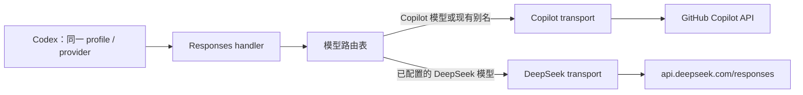

# DeepSeek 路由与多环境配置设计

日期：2026-09-11  
状态：待实现；本文不代表功能已经可用。

## 1. 目标与范围

让 Codex 在同一个 profile、同一个 `model_provider` 下，通过切换模型选择 Copilot 或 DeepSeek。Codex 始终请求本项目的 `/responses` 或 `/v1/responses`，代理按请求中的模型 ID 选择上游及其凭证。

同时移除模型目录生成逻辑中的 `E:/workshop/copilot-api`，支持开发机、Linux 服务和 Docker 分别配置输入目录、输出目录及 DeepSeek 接入参数。配置不依赖启动工作目录，不将个人绝对路径写入代码。

本期支持：

- DeepSeek 原生 Responses API：非流式、SSE、工具调用、取消请求及错误转发。
- 合并模型发现列表及 Codex 模型元数据；保留现有 Copilot 模型和别名行为。
- 配置文件、显式环境选择和环境变量覆盖；明确路径、验证及迁移规则。
- Copilot-only、Copilot + DeepSeek、DeepSeek-only 三种启动模式。

本期不增加 DeepSeek Chat Completions、Anthropic Messages、Embeddings、Files API、WebSocket 或 Responses 存储/检索接口，也不增加自动跨提供方重试、会话存储、计费聚合和配置热更新。

## 2. 当前实现与问题

| 位置 | 当前行为 | 需要调整 |
| --- | --- | --- |
| `src/lib/codex-models.ts` | 默认目录为 `E:/workshop/copilot-api`；读取 custom、下载上游、按 slug 合并、原子替换输出 | 显式传入已解析路径，支持多个元数据来源及离线回退 |
| `src/start.ts` | 无条件刷新模型目录、获取 GitHub/Copilot token、缓存 Copilot 模型 | 先加载配置，按启用的 provider 初始化 |
| `src/services/copilot/create-responses.ts` | 所有 Responses 请求发往 Copilot，使用 Copilot 专有 headers | 保留 Copilot transport，另加 DeepSeek transport |
| `src/routes/responses/handler.ts` | 解析模型别名后固定调用 Copilot；SSE 全局应用 item ID 修正 | 增加路由决策，按 provider 应用兼容策略 |
| `src/routes/models/route.ts` | 仅返回 Copilot 模型及别名，缓存缺失时会访问 Copilot | 增加启用的 DeepSeek 模型；DeepSeek-only 不触发 Copilot 初始化 |
| `src/lib/paths.ts` | 用户数据目录为 `~/.local/share/copilot-api` | 保留现有 token 路径，本期独立配置模型目录路径 |
| `Dockerfile` / `package.json` | 运行镜像和发布包主要携带 `dist` | 明确随包分发模型元数据，挂载环境配置及生成目录 |

`codex-models-custom.json` 是元数据输入，不是路由配置。即使其宽松 schema 接受额外字段，在里面加 `base_url` 也不会让 Codex 或本代理按该字段转发。

## 3. 请求架构



运行时配置构建一次不可变路由表。路由决策是请求局部变量，不能通过修改 `state` 中的“当前 provider”实现，避免并发请求互相改变上游。

建议接口：

```ts
type ProviderId = "copilot" | "deepseek"

interface ModelRoute {
  provider: ProviderId
  requestedModel: string
  upstreamModel: string
}

interface ResponsesTransport {
  create(body: ArrayBuffer | string, signal?: AbortSignal): Promise<Response>
}
```

不引入通用插件注册系统。第一版只有两个显式 transport 和一个纯函数路由解析器，沿用现有严格 TypeScript 及 `~/*` 导入约定。

### 3.1 路由规则与冲突

1. 校验请求为 JSON object，`model` 为非空字符串。无效 JSON、数组、缺失或无效 model 返回本地 `400 invalid_request_error`，不发往任何上游。
2. 优先匹配配置中 DeepSeek 模型的精确 ID。第一版公开 ID 等于 DeepSeek 上游 ID，不增加 DeepSeek 别名及响应 model 重写。
3. 其他模型沿用现有 Copilot 别名解析及 Copilot 路径。无需等待上游模型列表更新才能请求新 Copilot 模型。
4. `deepseek-` 前缀保留给 DeepSeek：未列入配置的 ID 返回 `400 model_not_configured`，provider 关闭时返回 `503 provider_disabled`。不将拼错的 DeepSeek 模型误发给 Copilot。
5. Copilot 关闭时，其他模型返回 `400 model_not_available`。上游失败不改变路由，不回退至其他 provider。
6. DeepSeek 精确 ID 与现有别名、已发现的 Copilot ID 冲突时启动失败，要求管理员消除冲突。未来确需同名模型时再设计显式命名空间。

DeepSeek 模型列表默认包含接入文档给出的 `deepseek-flash`、`deepseek-v4-pro`；这是可更新配置，不是永久写死的模型能力。实施时需验证这两个 ID 的实际可用性。

### 3.2 请求及流式转发

- 非别名请求仅解析以判断路由，尽可能保留原始 body 字节。Copilot 别名沿用仅重写顶层 model 的逻辑。
- DeepSeek 请求使用独立的 `Authorization: Bearer <DeepSeek key>`、`Content-Type` 和适当的 `Accept`。不复制客户端 Authorization、GitHub token、Copilot 专有 headers。
- DeepSeek `baseUrl` 默认为 `https://api.deepseek.com`。保留配置中已有路径前缀，去除末尾斜线后追加 `/responses`，不重复添加 `/v1`。
- 拒绝包含 userinfo、query、fragment 的 base URL；生产上游要求 HTTPS，HTTP 仅允许显式配置的 loopback 测试地址。带凭证请求不自动跟随重定向。
- `Response.body` 直接流式转发，保留背压；不先调用 `.text()` 等待完整 SSE，不 clone 整个 DeepSeek 流用于内容日志。
- 保留上游状态码、错误 body、Content-Type、request ID、cache-control，新增 `retry-after` 透传；不转发失效的 content-length 或 hop-by-hop headers。
- Copilot 的 item ID 修正保持现有开关与行为；DeepSeek 默认不应用此修正。只有复现 DeepSeek 的具体兼容问题后才增加单独策略。
- DeepSeek SSE 以 `response.completed`、`response.incomplete` 或 `response.failed` 结束，不插入 `[DONE]`，保留事件、顺序、未知字段及工具 call ID。
- 上游 HTTP 错误原样转发；建连失败使用本地 `502 upstream_connection_error`。流开始后的错误终止流并记录摘要，不拼接第二份 JSON 响应。
- 审批与现有全局限速仍覆盖两种 provider，路由验证先于审批。第一版明确共享限速，不假装是各上游独立配额。
- 保留现有 Copilot 请求信号兼容分支；验证 srvx 在 body 读取后对断连的信号行为，将客户端响应流取消继续传播给上游。单测不能替代真实 HTTP 断连检查。

### 3.3 非 Responses 接口

为 Chat Completions、Messages、Embeddings 的入口增加模型归属检查。请求 DeepSeek 模型时返回 `400 unsupported_provider_endpoint`，明确本期只支持 Responses，不能落入 Copilot transport。Copilot-only 路径保持兼容。

`/usage` 和 `/token` 继续仅代表 Copilot。DeepSeek-only 模式返回明确的 `503 provider_disabled`，不返回伪造的 DeepSeek 用量或 token。`--claude-code` 与 DeepSeek-only 组合启动时报错，混合模式的 Claude Code 选择列表仍只包含 Copilot 模型。

## 4. 多环境配置契约

新增 JSON 配置文件，通过已有 zod 做严格校验，不增加 YAML/TOML 解析依赖。以下全部为拟新增的项目配置，与 Codex 的 profile 无关。

### 4.1 文件选择与覆盖顺序

配置文件定位：`start --config <path>` > `COPILOT_API_CONFIG` > 当前工作目录的 `config.json`。前两种显式指定文件不存在则启动失败；默认文件不存在则使用默认配置。只解析被选中的一份文件，不扫描父目录。

环境选择：`start --env <name>` > `COPILOT_API_ENV` > `default`。显式选择不存在的环境报错；默认 `default` 可没有覆盖段。`NODE_ENV` 不选择本项目环境，避免 `bun run start` 的 production 值意外切换目录。

字段优先级从低到高：

1. 内置默认值。
2. 配置文件 `defaults`。
3. 配置文件 `environments[选定环境]`。
4. 本节列出的进程环境变量。

对象按字段合并，数组整体替换；`null`、未知字段、空路径和空模型列表均按 schema 明确拒绝。第一版 CLI 只增加 config/env 两个选择参数，现有 port、account-type、rate-limit 等 CLI 设置继续按现有逻辑工作，不混入第二套优先级。

### 4.2 配置样例

```json
{
  "version": 1,
  "defaults": {
    "providers": {
      "copilot": { "enabled": true },
      "deepseek": {
        "enabled": false,
        "baseUrl": "https://api.deepseek.com",
        "apiKey": "replace-with-your-deepseek-api-key",
        "models": ["deepseek-flash", "deepseek-v4-pro"]
      }
    }
  },
  "environments": {
    "windows-dev": {
      "providers": { "deepseek": { "enabled": true } }
    },
    "linux-service": {
      "providers": { "deepseek": { "enabled": true } }
    },
    "docker": {
      "providers": { "deepseek": { "enabled": true } }
    }
  }
}
```

个人盘符只出现在用户自己的配置样例中。仓库提交的 `config.example.json` 使用相对路径或通用部署路径，不内置 Jeff 的目录。

支持的环境变量：

| 变量 | 作用 |
| --- | --- |
| `COPILOT_API_CONFIG` | 配置文件位置 |
| `COPILOT_API_ENV` | 环境名称 |
| `COPILOT_API_COPILOT_ENABLED` | 开关 Copilot |
| `COPILOT_API_DEEPSEEK_ENABLED` | 开关 DeepSeek |
| `COPILOT_API_DEEPSEEK_BASE_URL` | 覆盖 DeepSeek endpoint |

布尔值仅接受 `true`/`false`；不使用 `Boolean("false")`。不自动读取 `.env`；不同运行时的 dotenv 行为不能成为配置契约。

### 4.3 路径规则

- CLI 或环境变量指定的配置文件相对路径，仅在启动时相对 cwd 转成绝对路径。
- 模型目录生成独立于 `config.json`：始终读取工作目录的 `codex-models-custom.json`，写入同目录的 `codex-models.json`。
- 临时文件与输出位于同目录，写完后 rename 替换，保留失败清理和旧输出不损坏的保证。
- 启动日志不输出密钥或完整运行时配置。

## 5. 模型目录与模型发现

### 5.1 元数据来源及合并

每次启动都调用 `refreshCodexModels(process.cwd())`，与 provider 配置是否存在或是否启用无关。

合并顺序：上游 Codex 模型目录 → `codex-models-custom.json`。相同 slug 后者胜出，保留上游其他顶层元数据。

新增随包 DeepSeek 元数据资源，例如 `src/providers/deepseek/models.json`，构建时嵌入或明确复制至 `dist`，验证发布包和 Docker 中无需源码目录也可读取。内容依据官方 Codex 接入样例，而非复制 GPT 的工具格式、上下文或推理能力。文件注释不能放入 JSON；来源 URL、核对日期及能力变更记录放入相邻 Markdown。

DeepSeek 的完整 Codex 元数据保存在 `codex-models-custom.json`；是否显示模型与 provider 是否启用彼此独立。目录存在不等于路由已启用或账号有调用权限。

### 5.2 失败及离线策略

- 配置语法、显式输入文件和本地元数据错误是管理员可修复的问题：启动失败并定位字段/文件。
- 远程目录仍保留 10 秒超时；联网失败优先使用单独保存的“最近成功上游目录缓存”，再与当前本地配置重新合并，不能把旧的最终目录当上游来源。
- 没有上游缓存时允许生成仅含有效本地元数据的目录，并明确告警上游模型列表不完整。远程成功后更新缓存；缓存与输出分别原子写入。
- 输出写入失败保留旧文件、警告并继续代理启动，同时明确提示 Codex 尚未获得新目录；不能宣称 DeepSeek 已在选择器可用。
- 不修改用户的 Codex config.toml，不自动导入旧 E 盘文件，也不删除旧目录。

### 5.3 `/models`

保留现有 OpenAI 风格列表字段，追加启用的 DeepSeek 模型，`owned_by` 为 `deepseek`。只合并列表展示 DTO，不伪造 Copilot 专用的 capabilities/tokenizer 类型。

`state.models` 继续仅用于 Copilot 缓存与 token 估算；新增列表构建函数组合 Copilot 数据、别名和 DeepSeek 配置。两种 `/models` URL 行为一致。DeepSeek-only 不触发 `cacheModels()` 的 Copilot 回退。

Codex 本地选择器仍通过 `model_catalog_json` 获取元数据；不能仅增加 `/models` 条目就视为完成客户端接入。

## 6. 初始化与凭证

启动顺序：解析并校验环境配置 → 校验至少一个 provider 启用 → 读取启用 provider 的必要凭证 → 初始化启用 provider → 构建路由及目录 → 输出状态摘要 → 启动 HTTP 服务。

- DeepSeek enabled=true 但 `apiKey` 缺失/空白时启动失败，不静默禁用。密钥直接保存在运行时配置中，不写入模型 JSON、响应、日志或错误。
- Copilot enabled=false 时跳过 `ensurePaths()` 中 GitHub token 文件创建、VS Code 版本查询、GitHub 登录、Copilot token 刷新、Copilot 模型拉取；将目录创建与 token 文件准备拆开。
- 混合模式下明确启用的任一 provider 初始化失败则启动失败。通过关闭该 provider 恢复服务，不隐式降级并改变请求去向。
- 保持 `--proxy-env` 的现有网络代理机制，DeepSeek 使用相同受控 fetch 环境。
- 现有 `--show-token` 不扩展到 DeepSeek；新 transport 不沿用别名请求的完整输入/输出日志。

日志只记录 provider、模型、状态码、request ID、耗时、必要的取消原因。账号用量界面第一版仍标注为 Copilot 用量，DeepSeek usage 由 Responses 原始响应交给客户端。

## 7. Codex 使用与跨模型兼容边界

完成实现后，用户级 Codex 配置固定为代理 provider，例如：

```toml
model_provider = "copilot_gateway"
model = "deepseek-flash"
model_catalog_json = "I:/Cache/workshop/copilot-api/codex-models.json"
web_search = "disabled"

[model_providers.copilot_gateway]
name = "Copilot + DeepSeek"
base_url = "http://localhost:4141/v1"
wire_api = "responses"
```

这段只展示路由相关字段；代理认证沿用实际部署设置。真实 DeepSeek key 配置在代理进程，不放进 Codex 的 gateway provider。切换到目录中的 Copilot 模型时无需修改 provider、endpoint 或 profile。

目录更新后重启 Codex，使用当前版本支持的模型目录诊断命令确认生效。容器部署时 model_catalog_json 指向宿主机挂载目录对应的绝对路径，不填写容器内部的 `/data` 路径。

必须明确以下兼容限制：

- **同一 profile 切换模型不等于任意历史对话可无损跨上游续聊。** DeepSeek 无状态，不支持 previous_response_id/conversation。非空这两项到达 DeepSeek 路由时，本地返回 `400 unsupported_conversation_state`，防止上游静默忽略后丢失上下文；调用方需发送完整可用的 input 历史。
- DeepSeek 不理解其他 provider 的 encrypted_content，也不支持任意内置工具输出或远程压缩状态。对无法用明文内容表示的 reasoning、compaction 或 item_reference 输入，返回明确 `400 unsupported_history_item`，不静默丢弃或跨 provider 解析 opaque 数据。实施时按实际 Codex payload 制定精确规则及 fixture。
- 对合法可兼容的文本、工具调用及工具结果历史原样转发。分别测试新任务选择模型与同一任务切换模型，后者不通过时必须记录客户端版本、具体 payload 和限制。
- DeepSeek 内置 web_search 等工具不执行。混用示例关闭 web_search，以获得确定的公共能力；不假定元数据能逐模型覆盖全部 Codex 配置。
- 本期只允许 DeepSeek 支持的 function 和名为 apply_patch 的 custom 工具。对请求中的其他活动内置工具返回 `400 unsupported_tool`，避免上游忽略工具却造成成功假象。客户端本地 MCP 若被展开为 function，则按普通 function 处理。
- 图片能力以 deepseek-flash 官方元数据及实测为准；仅代理已有图片输入，不实现文件上传或跨 provider file_id 迁移。
- `/responses/compact`、WebSocket 与服务器端 response 检索不在本期范围。不得在目录或 provider 配置中宣称支持；发布前确认测试版本 Codex 可使用 HTTP/SSE 和客户端本地压缩流程。

## 8. 环境部署与迁移

### Windows 开发

1. 创建用户自己的配置文件，选择 windows-dev 并指向实际 I 盘输入/输出。
2. 在启动代理的环境中设置 DeepSeek key。
3. 使用 `bun run src/main.ts start --config <绝对配置路径> --env windows-dev`。
4. 将 Codex 的 model_catalog_json 更新为启动日志打印的输出路径，重启客户端验证。

后续更新 `start.bat`：使用脚本目录定位入口，显式传入配置/env 或允许环境变量配置；不依赖调用者 cwd，不将用户的盘符写进脚本。

### Linux 服务

配置放 `/etc/copilot-api/config.json`，输出放 `/var/lib/copilot-api`，由服务用户拥有输出目录。服务管理器注入环境和密钥，显式传 `--config`、`--env linux-service`。不要求源码仓库可写。

### Docker

挂载 `/config` 为只读配置目录、`/data` 为可写生成目录，显式传 `--config /config/config.json --env docker`，通过运行环境注入 key。entrypoint 对 DeepSeek-only 不强制要求 GH_TOKEN。将生成目录挂载到宿主机后供宿主机 Codex 读取。

发布检查必须在仅包含最终镜像/发布包的环境进行，避免本地源码中的 models.json 掩盖资源漏打包。

### 从旧硬编码迁移

旧版本实际读取 E 盘目录，即使工作区在 I 盘。迁移时先确认 E 盘输入与当前仓库输入哪份是用户期望的版本，再显式配置该输入或复制到新位置；不自动以“最新修改时间”判断。

切换后校验生成目录包含原有自定义模型和启用的 DeepSeek 条目。旧文件保留以便回退。回退只需还原原有启动配置及 Codex 目录引用；不改变 GitHub token 存储。

## 9. 文件变更计划

| 文件/模块 | 拟议变更 |
| --- | --- |
| `src/lib/runtime-config.ts`（新增） | schema、文件选择、环境覆盖、变量解析、路径规范化和明确配置错误 |
| `src/lib/model-routing.ts`（新增） | 模型路由纯函数、冲突验证、接口支持检查 |
| `src/services/deepseek/create-responses.ts`（新增） | 独立 DeepSeek fetch、认证和取消传递 |
| `src/providers/deepseek/models.json` 及说明（新增） | 有来源记录的 Codex 元数据，随构建打包 |
| `src/routes/responses/handler.ts` | 根据路由调用 transport，provider 专属兼容检查及 SSE 策略 |
| `src/lib/error.ts` | 本地类型化错误及稳定 code；上游原始 Responses 错误仍直接转发 |
| `src/routes/models/route.ts` | 合并展示列表，去除 DeepSeek-only 的 Copilot 初始化依赖 |
| Chat Completions / Messages / Embeddings handlers | 不支持的 DeepSeek 请求在入口明确拒绝 |
| `src/lib/codex-models.ts` | 显式输入/输出、元数据合并、上游缓存和原子写入 |
| `src/start.ts`、`src/lib/state.ts`、`src/lib/paths.ts` | 注入 runtime config，按 provider 初始化，拆开目录及 token 准备 |
| `config.example.json`、README、start.bat、Dockerfile、entrypoint.sh | 多环境使用、迁移、资源打包和挂载说明 |
| `tests/` | 配置、路由、transport、流式、目录及启动回归 |

## 10. 验证与验收

### 自动化测试

| 范围 | 关键用例 |
| --- | --- |
| 配置 | 优先级、数组替换、显式文件/环境缺失、未知字段、非法 bool、缺 key、两个 provider 均关闭 |
| 路径 | Windows/Linux 原生路径与 Windows 盘符解析用例、相对路径锚定、改变 cwd 不改变文件内路径、输入输出冲突、目录不可写 |
| 路由 | DeepSeek 精确匹配、保留前缀拼错、别名回归、ID 冲突、并发两种模型不串路由、不跨上游 fallback |
| transport | URL 前缀/末尾斜线、独立认证、无 Copilot/客户端 header 泄漏、HTTP 错误、retry-after、重定向、AbortSignal |
| Responses | 非流式与 SSE，分块 JSON/UTF-8、工具调用往返、三种终止事件、DeepSeek 不应用 Copilot item ID 修正 |
| 兼容边界 | previous_response_id/conversation 拒绝、opaque 历史拒绝、完整文本/工具历史可通过、不支持工具/接口明确报错 |
| 目录 | 按 slug 覆盖、完整元数据、禁用模型过滤、上游缓存离线回退、首次离线、本地输入错误、写入失败旧文件完整 |
| 启动 | 默认 Copilot-only、混合模式、DeepSeek-only 不读取/获取 GitHub 凭证、不触发 VS Code/Copilot 网络请求 |

外部 API 用 fetch mock 验证，不在普通测试中消耗真实额度。适当扩展现有 `tests/codex-models.test.ts`、`tests/create-responses.test.ts`、`tests/responses-route.test.ts`，不要只测试新增纯函数而漏掉入口集成。

实施后的项目检查按实际 package.json 运行：`bun run typecheck`、`bun run lint`、`bun test`、`bun run build`。当前 build 是 tsdown，AGENTS.md 中 tsup 描述已过时。

### 集成验收

1. 真实 srvx 服务下验证 SSE 首事件及时到达、客户端取消能终止上游，不发生全量缓存。
2. 用可用测试账号验证 DeepSeek 两个配置模型的文字及工具调用；验证 deepseek-flash 图片输入。
3. Codex 固定一个 gateway provider，在同一 profile 分别选择 Copilot 和 DeepSeek；日志证明不同模型发往正确上游。
4. 独立验证同一任务携带文本与工具历史切换；如果出现不兼容 opaque 状态，返回上述明确错误并记录限制，不宣称任意对话无损切换。
5. Windows、Linux 和 Docker 改变启动 cwd 后，仍使用配置中的同一组文件；只读配置与可写生成目录可以分离。
6. 在发布包/镜像中验证 DeepSeek 元数据存在，Codex 本地生成目录可加载，Copilot 模型和原有别名无回归。

## 11. 建议实施顺序

1. 配置与路径：增加环境配置、移除 E 盘默认值、目录读写拆分，先通过配置/目录测试。
2. provider 初始化与路由：引入 DeepSeek transport、明确错误、模型列表及其他接口防误路由，通过凭证隔离与路由测试。
3. Codex 元数据及兼容：加入随包元数据、流式/provider 策略、无状态和历史约束，通过工具与 SSE 测试。
4. 部署与实测：更新启动入口、镜像、README 和迁移步骤，完成三个环境与同 profile 切换验收。

每一步保持默认 Copilot-only 可运行。最终是否支持同一任务跨模型续聊以第 10 节实测结果为准，不以“模型出现在选择器里”替代可用性验收。

## 12. 依据

- [DeepSeek：接入 Codex](https://api-docs.deepseek.com/zh-cn/quick_start/agent_integrations/codex/)：provider、模型目录、模型 ID 及原生 Responses 接入。
- [DeepSeek：Responses API](https://api-docs.deepseek.com/zh-cn/guides/responses_api/)：SSE 终止事件、无状态限制、工具和历史 item 兼容性。
- [OpenAI：高级配置](https://learn.chatgpt.com/docs/config-file/config-advanced#custom-model-providers)：provider 的 endpoint/认证职责与模型目录配置。
- 本仓库第 2 节列出的源码与现有测试。外部文档核对日期为 2026-09-11；具体能力和客户端行为在实施验收时再次核对。
